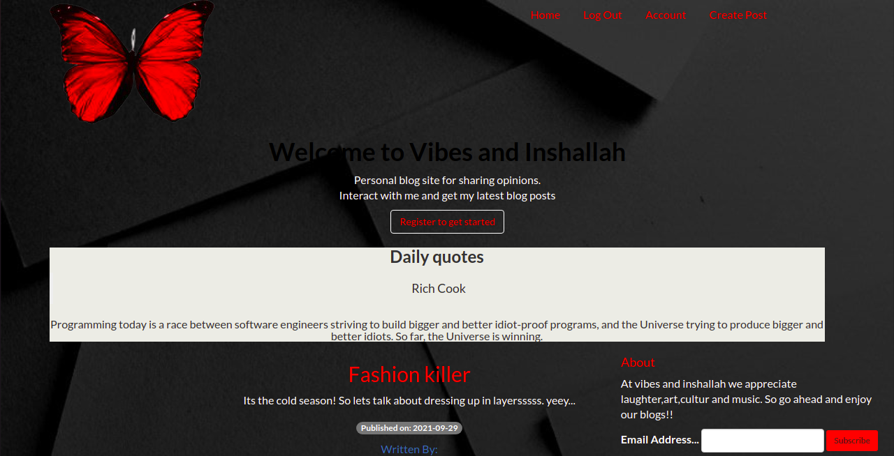
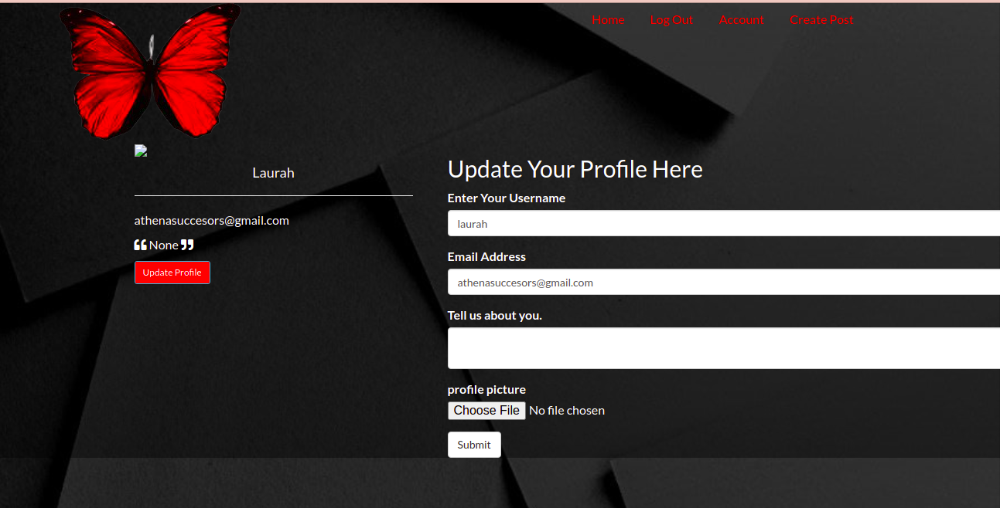
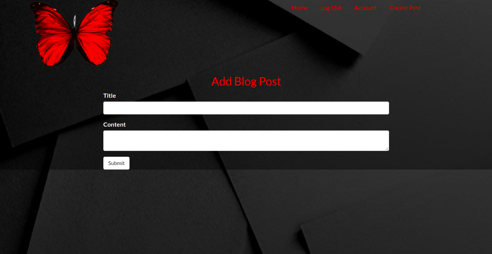
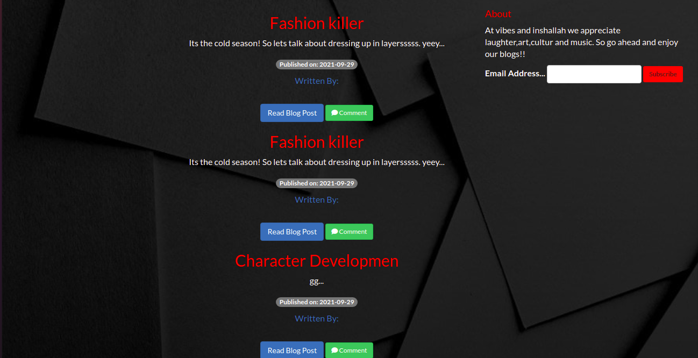

# VIBES AND INSHALLAH
## Author
Laurette
[Laurette](https://github.com/LauretteMongina/Vibes-and-Inshallah_Blog.git)

# Description
This  is a flask application that allows writers to post blogs, edit and delete blogs. It also allows users who have signed up to comment on the blogs that has been posted by a writer. 

## Live Link
[View Site](https://vibesandinshallah.herokuapp.com/)

## Screenshots

## User Story

*As a user, I would like to view the blog posts on the site
*As a user, I would like to comment on blog posts
*As a user, I would like to view the most recent posts
*As a user, I would like to an email alert when a new post is made by joining a subscription.
*As a user, I would like to see random quotes on the site
*As a writer, I would like to sign in to the blog.
*As a writer, I would also like to create a blog from the application.
*As a writer, I would like to delete comments that I find insulting or degrading.
*As a writer, I would like to update or delete blogs I have created.

## BDD
| Behaviour | Input | Output |
| :---------------- | :---------------: | ------------------: |
| Load the page | *On page load* | Get all blogs, Select between signup and login|
| Select SignUp| *Email,Username,Password* | Redirect to login|
| Select Login | *Username* and *password* | Redirect to page with blogs that have been posted by writes and be able to subscribe to the blog|
| Select comment button | *Comment* | Form that you input your comment|
| Click on submit |  | Redirect to all comments tamplate with your comment and other comments|

## Development Installation
To get the code..

1. Cloning the repository:
  bash
  https://github.com/LauretteMongina/Vibes-and-Inshallah_Blog.git
  
2. Move to the folder and install requirements
  bash
  cd Vibes-and-Inshallah
  pip install -r requirements.txt
  
3. Exporting Configurations
  bash
  export SQLALCHEMY_DATABASE_URI=postgresql+psycopg2://{User Name}:{password}@localhost/{database name}
  
4. Running the application
  bash
  python manage.py server
  
5. Testing the application
  bash
  python manage.py test
  
Open the application on your browser `127.0.0.1:5000`.

## Technology used

* [Python3.6](https://www.python.org/)
* [Flask](http://flask.pocoo.org/)
* [Heroku](https://heroku.com)

## Known Bugs
* User is not able to delete a blog

## Contact Information 

If you have any question or contributions, please email me at [monginalaurette@gmail.com]

## License
* MIT License:
* Copyright (c) 2021 *Laurette*